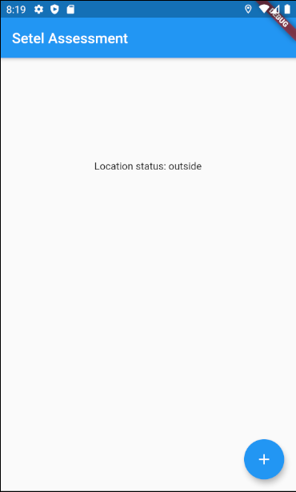
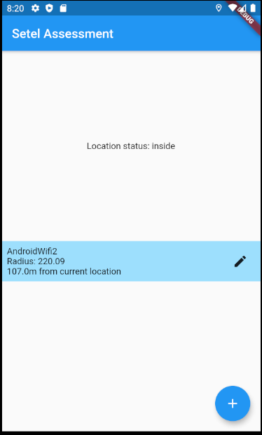
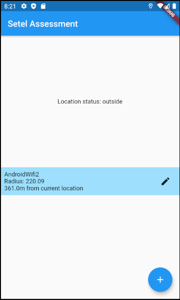
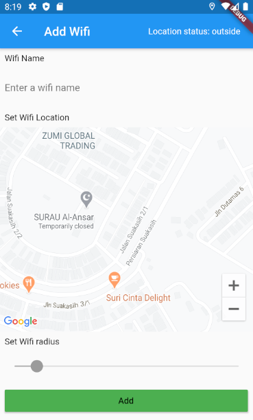
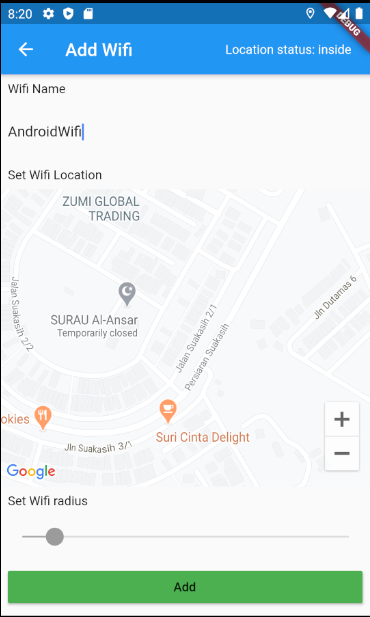
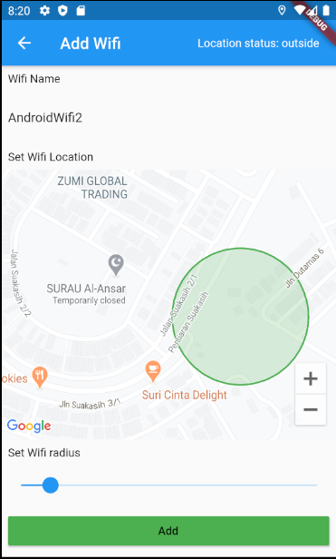
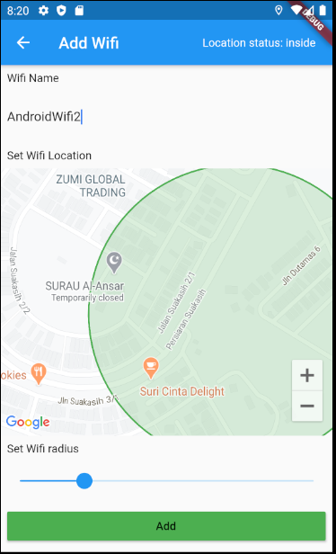

# setel_assessment

Assessment project for Setel.

**Apk is available on root dir [here](app-release.apk)**

## Requirement
Requirements are wrote [here](https://docs.google.com/document/d/1pkxwhGSmvDei3BRm9Ix7tVUGose_Lpp-MBJzvO1T31w/edit)

### Prerequisites
1. Flutter
2. Android Studio / XCode - For emulator / simulator
3. IDE - Android Studio, IntellliJ IDEA, VSCode.

### Running
1. `flutter run` on terminal or IDE configuration setup.

## Build with
1. Architecture.
    1. [Flutter_hooks](https://pub.dev/packages/flutter_hooks) - UI Management
    2. [Intl](https://pub.dev/packages/intl) - Internationalization (supported locale is English and Malay)
    
    **note**: Internationalization is built with [Flutter_intl_jetbrain](https://plugins.jetbrains.com/plugin/13666-flutter-intl) plugins.
    There's also plugins for [vscode](https://marketplace.visualstudio.com/items?itemName=localizely.flutter-intl)

2. Repository
    1. [Hive](https://pub.dev/packages/hive)
    2. [Hive_flutter](https://pub.dev/packages/hive_flutter)

### Running
1. `flutter run` on terminal or IDE configuration setup.

## Formatter
1. Run `dartfmt -w lib/ test/`

## Features
1. Home Page.
* Feature to add / save which point & Wi-Fi 
* Update status by location tracking.
* Update status by changing on selected items.





2. Edit / Add screen
* Add Wi-Fi name
* Point on the map where to set geofence
* Resize geofence area
* Display current status on editing.






<details>
    <summary>flutter doctor -v</summary>
    
    ```
    [✓] Flutter (Channel stable, v1.17.2, on Linux, locale en_US.UTF-8)
        • Flutter version 1.17.2 at /home/yuzuriha/devenv/flutter
        • Framework revision 5f21edf8b6 (5 days ago), 2020-05-28 12:44:12 -0700
        • Engine revision b851c71829
        • Dart version 2.8.3
    
     
    [✓] Android toolchain - develop for Android devices (Android SDK version 29.0.3)
        • Android SDK at /home/yuzuriha/Android/Sdk
        • Platform android-29, build-tools 29.0.3
        • Java binary at: /home/yuzuriha/.local/share/JetBrains/Toolbox/apps/AndroidStudio/ch-0/193.6514223/jre/bin/java
        • Java version OpenJDK Runtime Environment (build 1.8.0_242-release-1644-b3-6222593)
        • All Android licenses accepted.
    
    [!] Android Studio (version 3.6)
        • Android Studio at /home/yuzuriha/.local/share/JetBrains/Toolbox/apps/AndroidStudio/ch-0/192.6392135
        ✗ Flutter plugin not installed; this adds Flutter specific functionality.
        ✗ Dart plugin not installed; this adds Dart specific functionality.
        • Java version OpenJDK Runtime Environment (build 1.8.0_212-release-1586-b4-5784211)
    
    [!] Android Studio (version 4.0)
        • Android Studio at /home/yuzuriha/.local/share/JetBrains/Toolbox/apps/AndroidStudio/ch-0/193.6514223
        ✗ Flutter plugin not installed; this adds Flutter specific functionality.
        ✗ Dart plugin not installed; this adds Dart specific functionality.
        • Java version OpenJDK Runtime Environment (build 1.8.0_242-release-1644-b3-6222593)
    
    [✓] Connected device (1 available)
        • sdk gphone x86 • emulator-5554 • android-x86 • Android 10 (API 29) (emulator)
    ```
</details>

## Authors

* [**Yusuf Rosman**](https://github.com/zaralockheart)
